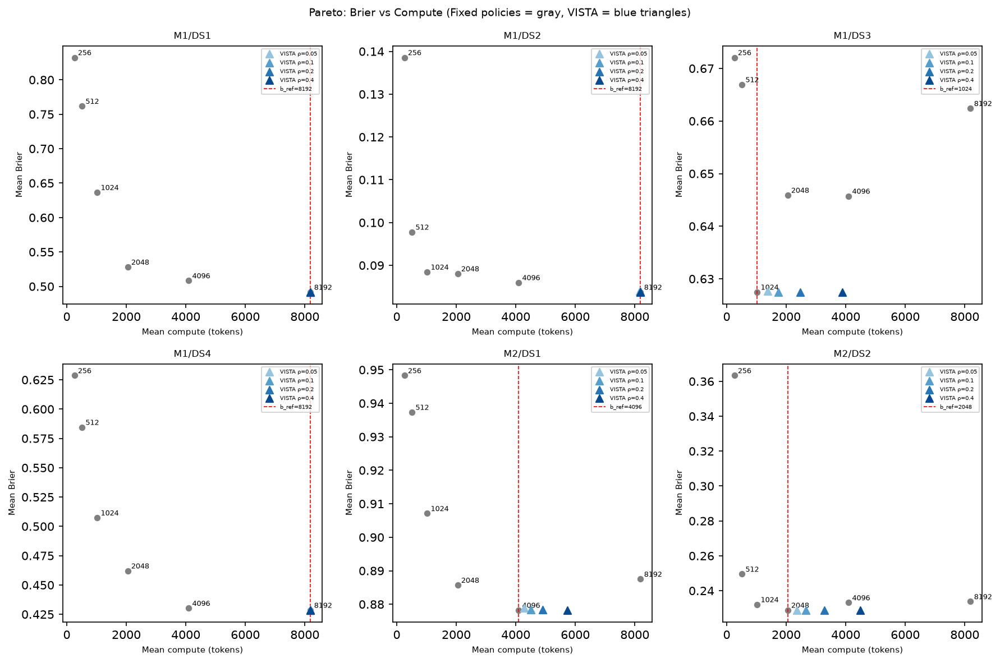
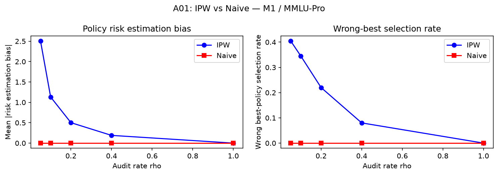
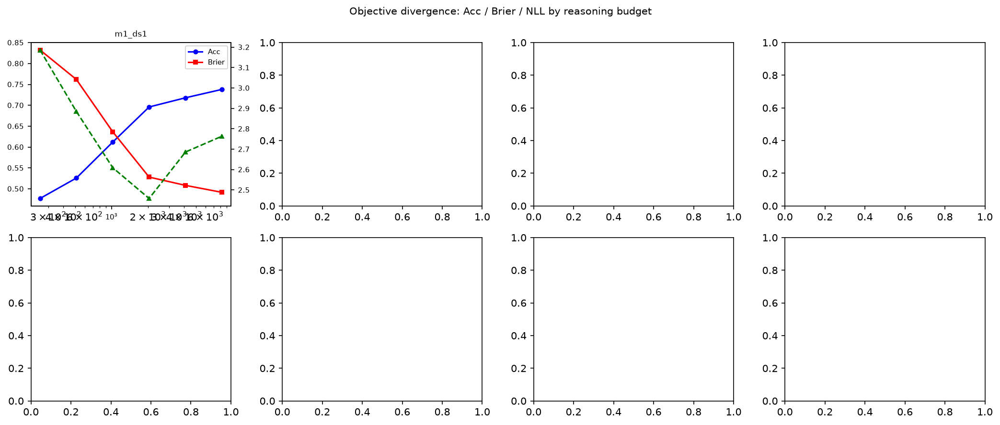
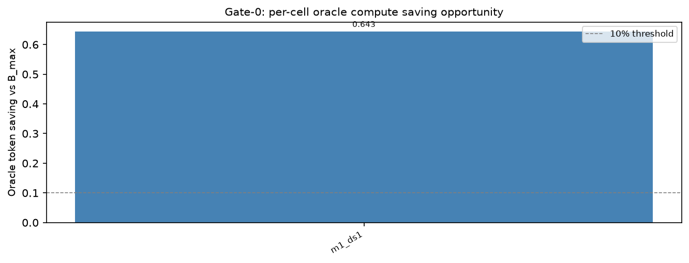
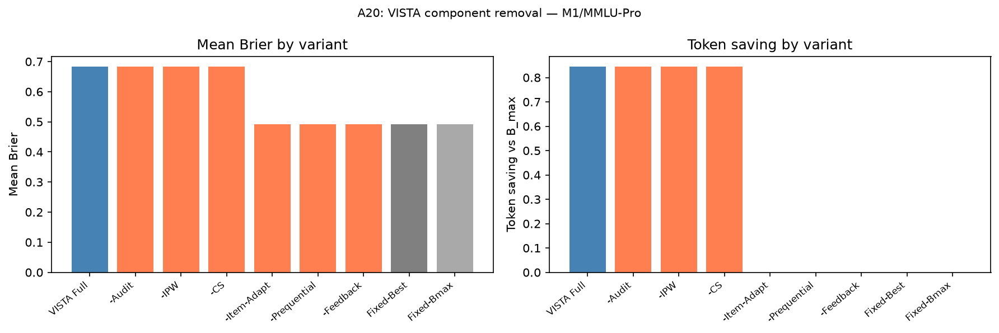
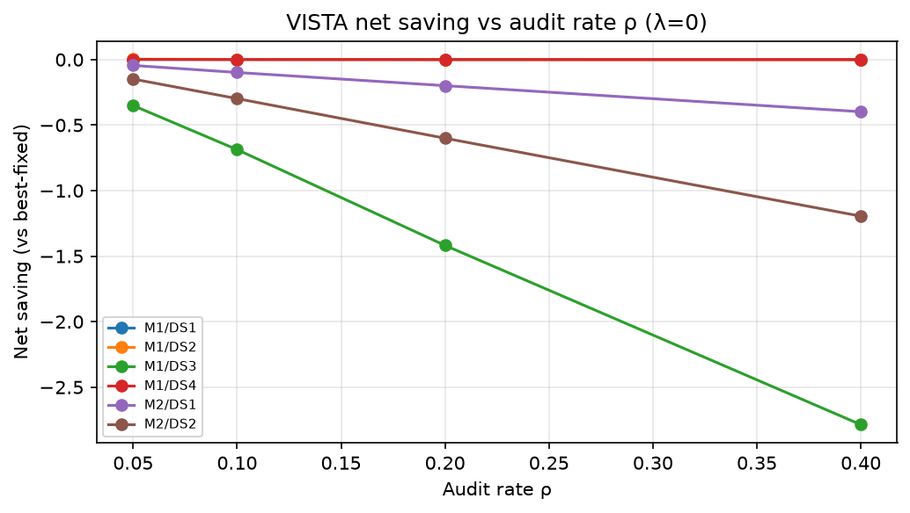

# VISTA: Value-Informed Sequential Test-time Allocation

**Paper:** *VISTA: Value-Informed Sequential Test-time Allocation*  
**Authors:** Jun-young Kong, Young-guk Ha (Konkuk University)  
**Venue:** Submitted to *Information Sciences* (Elsevier)

> VISTA is a prequential procedure for selecting reasoning-token budgets from deployment data—without a held-out calibration set. It combines randomized full-trajectory audits, importance-weighted policy comparison, and anytime-valid confidence sequences to certify budget reductions with a coverage guarantee.

---

## The Problem

<p align="center">
  
</p>

Trajectory signals are ambiguous (the same reasoning style can lead to both correct and incorrect answers), and early stopping hides the counterfactual continuation needed to evaluate whether more thinking would help. **VISTA resolves this with occasional randomized full-trajectory audits** that reconstruct what would have happened—enabling data-driven estimation of each additional budget token's marginal value.

---

## Method

<p align="center">
  
</p>

VISTA operates online on the incoming item stream:

1. **Randomized audit** — each item is fully continued to the reference budget with probability ρ; the rest run the current stopping policy.
2. **IPW estimation** — audited items are re-weighted by 1/ρ to recover an unbiased estimate of the full-population policy risk.
3. **Anytime-valid monitoring** — a confidence sequence tests whether a cheaper policy is certifiably better, controlling false-positive switches at any stopping time.
4. **Prequential update** — the stopping threshold adapts online from arriving feedback, requiring no held-out calibration set.

---

## Budget-Response Curves Differ Across Tasks

<p align="center">
  
</p>

Accuracy and Brier score as a function of reasoning budget for both models across all four QA benchmarks. Patterns are **not uniform**: ARC-Challenge saturates early, MedQA-USMLE keeps improving, and M2 Brier *worsens* on medical datasets at higher budgets—ruling out any universal fixed allocation.

<p align="center">
  
</p>

---

## Results

### Quality–Compute Frontier (M1 / MMLU-Pro)

<p align="center">
  
</p>

| Method | Tokens ↓ | Brier ↓ | Net saving | Held-out? |
|--------|-------:|-------:|----------:|:---------:|
| Best fixed (b=8192) | 8 192 | 0.492 | 0.0% | — |
| Confidence stopping (τ=0.90) | 1 453 | 0.664 | +82.3% | No |
| Entropy stopping | 1 624 | 0.643 | +80.2% | No |
| Stability stopping | 1 655 | 0.608 | +79.8% | No |
| **VISTA (λ=0)** | 8 191 | **0.492** | **0.0%** | **No** |
| **VISTA (λ=0.01)** | 7 931 | **0.498** | **+3.2%** | **No** |
| **VISTA (λ=0.1)** | 7 414 | **0.505** | **+9.5%** | **No** |

Threshold policies achieve 80–83% gross token reduction but **increase Brier by +0.115 to +0.172** relative to best fixed, with no quality guarantee. VISTA at λ=0.01 saves 3.2% tokens at only +0.6 pp Brier (95% CI from 200 stream-order permutations).

### Full 8-Cell Results

| Cell | Oracle C saving | VISTA λ=0.01 saving | VISTA λ=0.1 saving |
|------|:--------------:|:-------------------:|:------------------:|
| M1 / MMLU-Pro | 94.4% | 3.2% | 9.5% |
| M1 / ARC-Challenge | 0.0% (Gate-0 Fail) | — | — |
| M1 / MedMCQA | 74.1% | 3.5% | 18.7% |
| M1 / MedQA-USMLE | 95.6% | 4.1% | 35.0% |
| M2 / MMLU-Pro | 97.0% | 3.0% | 9.0% |
| M2 / ARC-Challenge | 92.0% | 2.7% | 11.2% |
| M2 / MedMCQA | 0.0% (Gate-0 Fail) | — | — |
| M2 / MedQA-USMLE | 0.0% (Gate-0 Fail) | — | — |

*Gate-0 Fail = best fixed budget is already b=256; no adaptive headroom exists.*

<p align="center">
  
</p>

---

## Ablations

### A1 · IPW vs Naive Estimation

<p align="center">
  
</p>

Unweighted (Naive) estimation uses only naturally-continued items. Because only 0.1–18% of items reach the reference budget under a natural confidence gate, the naive estimator operates on a **severely selected minority**—selecting the wrong best policy in 100% of permutations on 5 of 8 cells. IPW re-weights audited items by 1/ρ, reducing mean bias by **2.2×–23×**.

### A5 · Objective Divergence

<p align="center">
  
</p>

Brier, accuracy, and NLL objectives prefer **different optimal budgets**, making the choice of loss function a first-order decision.

### Oracle Saving Headroom

<p align="center">
  
</p>

### Component Removal

<p align="center">
  
</p>

Removing IPW leaves the λ=0 outcome unchanged (bias without consequence at this operating point), but removing the confidence sequence (CS) causes **~7% false-positive policy switches**, deploying a cheaper lower-quality policy and raising mean Brier from 0.492 to 0.522 (+3.0 pp).

---

## Audit Rate Sensitivity

<p align="center">
  
</p>

When b_ref = B_max, audit overhead is negligible (audited items already run to the full budget). Net saving is stable across ρ ∈ {0.05, 0.10, 0.20, 0.40} on M1/MMLU-Pro.

---

## Hardware

| GPU | VRAM | Arch | Role |
|-----|-----:|:----:|------|
| RTX 4090 × 1 | 24 GB | sm\_89 (Ada) | M1 (Qwen3-8B), all 4 datasets |
| RTX 3090 × 2 | 24 GB | sm\_86 (Ampere) | M2 (DeepSeek-R1-Distill-Llama-8B), split across datasets |

All runs: `gpu_memory_utilization=0.85`, BF16, `kv_cache_dtype=auto`, `enable_prefix_caching=True`.

---

## Models & Datasets

| ID | Model | HF path |
|----|-------|---------|
| M1 | Qwen3-8B | `Qwen/Qwen3-8B` |
| M2 | DeepSeek-R1-Distill-Llama-8B | `deepseek-ai/DeepSeek-R1-Distill-Llama-8B` |

| ID | Dataset | Items |
|----|---------|------:|
| DS1 | MMLU-Pro | 1 000 |
| DS2 | ARC-Challenge | 1 000 |
| DS3 | MedMCQA | 500 |
| DS4 | MedQA-USMLE | 500 |

Budget grid: **[256, 512, 1024, 2048, 4096, 8192]** tokens (6 levels). Total: 2 698 items × 2 models = **5 396 items**.

---

## Repository Layout

```
paper.tex / paper.pdf          ← camera-ready source and compiled PDF
mvtcs.bib                      ← bibliography

scripts/                       ← all runnable scripts
  m0_capacity_probe.py         ← Step 0: throughput probe + cross-GPU logit check
  prep_corpus.py               ← download & serialise dataset items
  run_corpus.py                ← generate prefix checkpoint tables (all GPU tracks)
  run_ablations.py             ← offline ablation runner (CPU, cached tables)
  run_ablation_campaign.py     ← batch ablation orchestration
  run_vista_full.py            ← full VISTA deployment evaluation
  make_ablation_report.py      ← generate ablation figures / tables
  diag_logits.py               ← logit fingerprint diagnostics (D1–D5)
  m2_smoke_test.py             ← quick smoke test for M2
  build_bib.py / compare_refs.py / fetch_refs.sh  ← bib utilities

analysis/                      ← importable library
  baselines.py                 ← threshold stopping policies
  vista_deployment.py          ← VISTA streaming evaluator
  metrics.py                   ← Brier, NLL, confidence, margin
  gate0.py / gate1.py          ← adaptive-opportunity tests
  data_loader.py               ← prefix-table I/O

data/
  items_ds{1..4}.json          ← prepared dataset items
  results_m{1,2}_ds{1..4}_*.json  ← option_probs + Brier per (item, budget)
  prefixes_*.jsonl             ← checkpoint prefix tables (tracked via Git LFS)

figures/
  img/img1.png                 ← motivation diagram
  img2.png                     ← VISTA method overview
  fig4.png                     ← budget-response curves (both models)
  fig_budget_response.png      ← budget response M1
  fig_frontier_audit.png       ← quality-compute frontier + ρ sensitivity
  fig5.png                     ← frontier + ρ (updated)
  fig_nll.png                  ← NLL results
  ablations/                   ← ablation figures (A01, A05, A08, A20)
  vista_full/                  ← deployment result figures

results/
  vista_full/                  ← VISTA deployment JSON results
  ablations/                   ← per-ablation JSON results

logs/                          ← experiment run logs
docs/                          ← diagnostics notes, corpus plan, refs.tsv
```

---

## Quickstart

```bash
# 0. Activate environment
source .venv/bin/activate
export CUDA_DEVICE_ORDER=PCI_BUS_ID
export PATH="$PATH:/home/sclab/miniconda3/envs/dualmoe/bin"  # nvcc for FlashInfer JIT

# 1. Capacity probe (run once per GPU)
CUDA_VISIBLE_DEVICES=0 python scripts/m0_capacity_probe.py --gpu-tag 4090  --util 0.85
CUDA_VISIBLE_DEVICES=1 python scripts/m0_capacity_probe.py --gpu-tag 3090a --util 0.85
CUDA_VISIBLE_DEVICES=2 python scripts/m0_capacity_probe.py --gpu-tag 3090b --util 0.85

# 2. Prepare dataset items
python scripts/prep_corpus.py

# 3. Generate prefix checkpoint tables (all GPU tracks in parallel)
python scripts/run_corpus.py

# 4. Run offline ablations (CPU, no GPU needed)
python scripts/run_ablations.py

# 5. Full VISTA deployment evaluation
python scripts/run_vista_full.py
```

---

## Hard Rules

1. **No tensor parallelism for 8B models** — each fits on one 24 GB card; TP across mixed architectures is slower.
2. **`enable_prefix_caching=True` always** — without it, cost is ~6× and the project is infeasible.
3. **BF16 KV cache only** (`kv_cache_dtype=auto`) — fp8_e5m2 changes top-1 tokens on 8% of prompts; permanently banned.
4. **No architecture mixing per cell** — 4090 (sm\_89) and 3090 (sm\_86) produce logit differences up to |Δ| = 0.374; each (model × dataset) cell is pinned to a single GPU architecture.
5. **`BUDGET_GRID` and `SAMPLING` are frozen** — any change invalidates all cached generations.
6. **Generate once, replay many** — all analysis runs on cached prefix tables on CPU; never regenerate to vary stream order.

---

## Citation

```bibtex
@article{kong2026vista,
  title   = {{VISTA}: Value-Informed Sequential Test-time Allocation},
  author  = {Kong, Jun-young and Ha, Young-guk},
  journal = {Information Sciences},
  year    = {2026},
  note    = {Under review}
}
```
