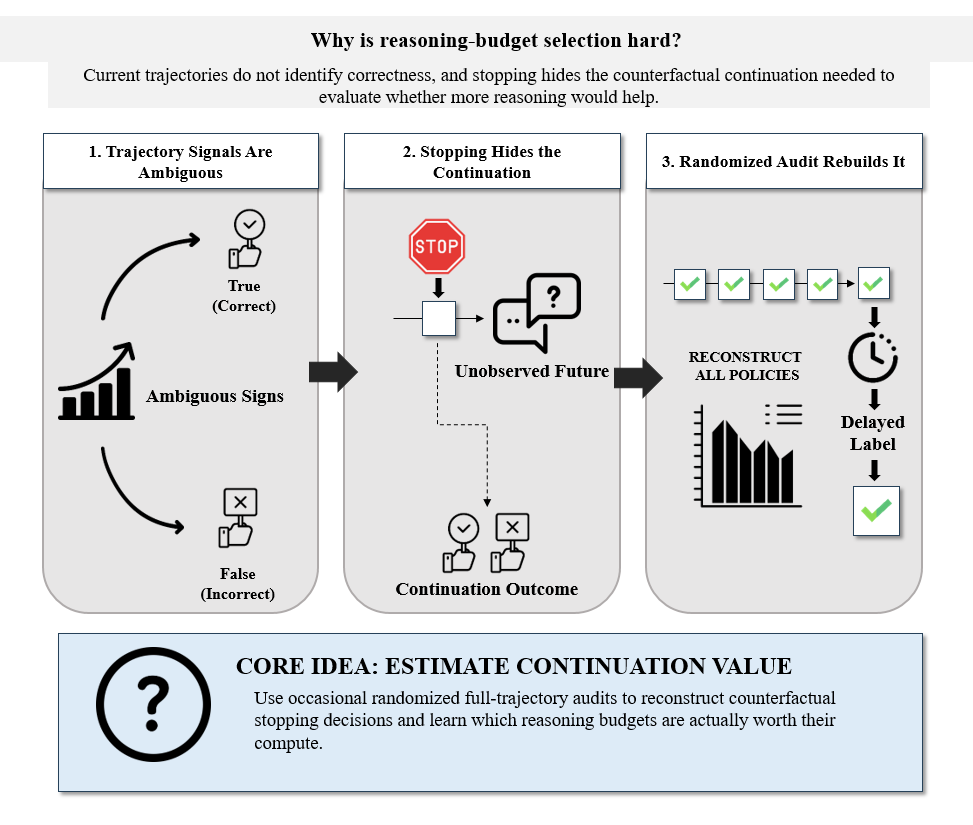
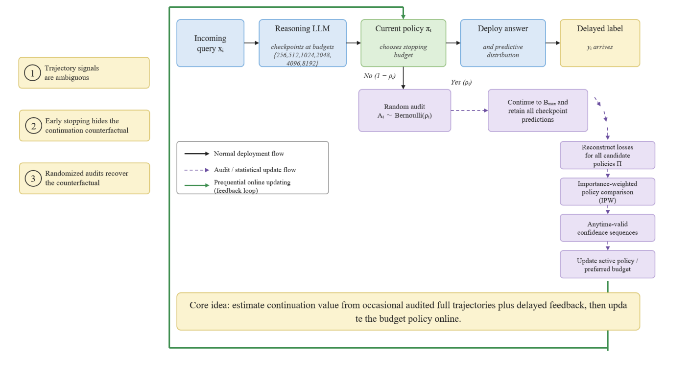
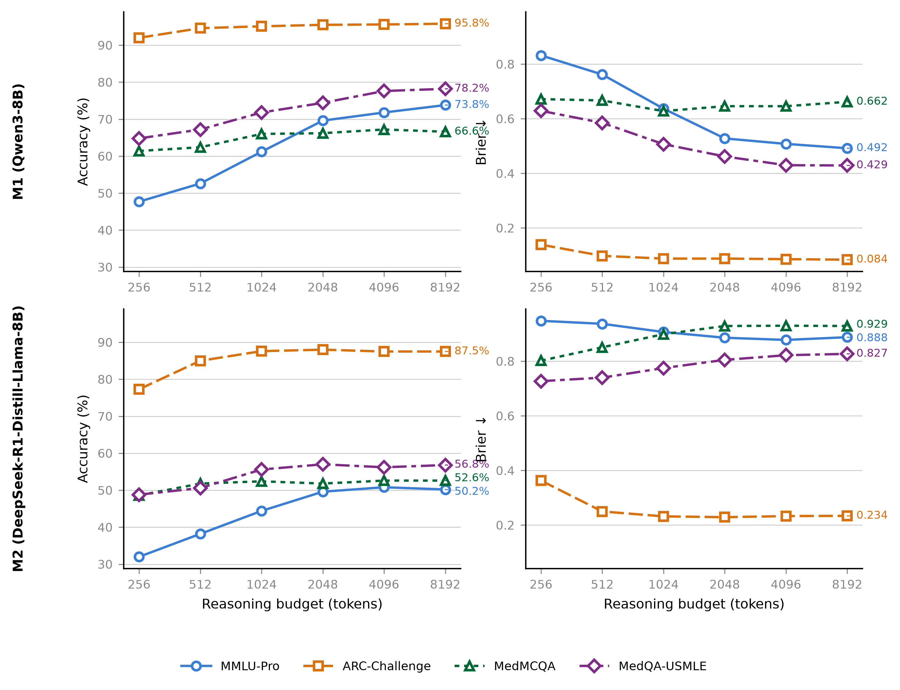
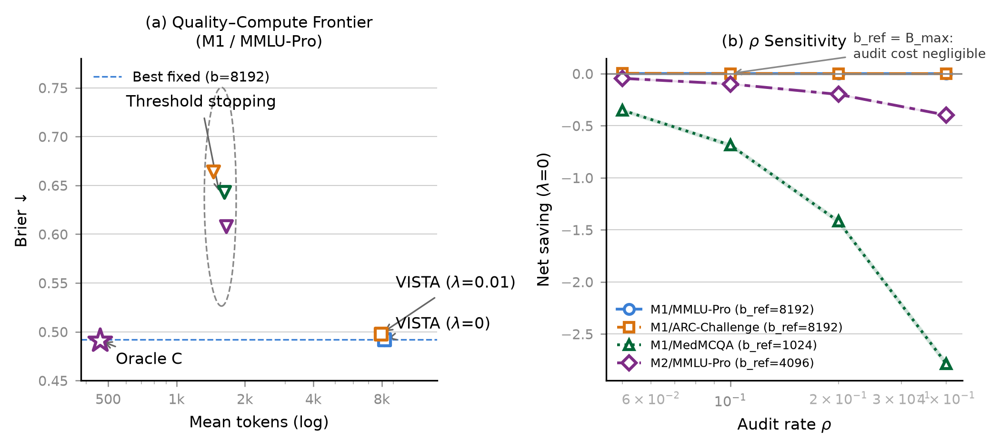

# VISTA: Value-Informed Sequential Test-time Allocation

**Paper:** *VISTA: Value-Informed Sequential Test-time Allocation*  
**Authors:** Jun-young Kong, Young-guk Ha (Konkuk University)  
**Venue:** Submitted to *Information Sciences* (Elsevier)

> VISTA is a prequential procedure for selecting reasoning-token budgets from deployment data—without a held-out calibration set. It combines randomized full-trajectory audits, importance-weighted policy comparison, and anytime-valid confidence sequences to certify budget reductions with a coverage guarantee.

---

## The Problem

<p align="center">
  
</p>

Trajectory signals are ambiguous, and early stopping hides the counterfactual continuation needed to evaluate whether more reasoning helps. VISTA uses occasional randomized full-trajectory audits to reconstruct what would have happened—enabling data-driven estimation of each budget token's marginal value.

---

## Method

<p align="center">
  
</p>

VISTA operates online on the incoming item stream:

1. **Randomized audit** — each item is fully continued to the reference budget with probability ρ; the rest run the current stopping policy.
2. **IPW estimation** — audited items are re-weighted by 1/ρ to recover an unbiased estimate of full-population policy risk.
3. **Anytime-valid monitoring** — a confidence sequence tests whether a cheaper policy is certifiably better, controlling false-positive switches at any stopping time.
4. **Prequential update** — the stopping threshold adapts online from arriving feedback; no held-out calibration set required.

---

## Budget-Response Curves (M1 & M2, All Four Datasets)

<p align="center">
  
</p>

Accuracy and Brier score as a function of reasoning budget across both models and all four QA benchmarks. Patterns are **heterogeneous**: ARC-Challenge saturates early, MedQA-USMLE keeps improving, and M2 Brier *worsens* on medical datasets at higher budgets—ruling out any universal fixed allocation.

---

## Results — Quality–Compute Frontier

<p align="center">
  
</p>

| Method | Tokens ↓ | Brier ↓ | Net saving | Held-out? |
|--------|-------:|-------:|----------:|:---------:|
| Best fixed (b=8192) | 8 192 | 0.492 | 0.0% | — |
| Confidence stopping (τ=0.90) | 1 453 | 0.664 | +82.3% | No |
| Entropy stopping | 1 624 | 0.643 | +80.2% | No |
| Stability stopping | 1 655 | 0.608 | +79.8% | No |
| **VISTA (λ=0)** | 8 191 | **0.492** | **0.0%** | **No** |
| **VISTA (λ=0.01)** | 7 931 | **0.498** | **+3.2%** | **No** |
| **VISTA (λ=0.1)** | 7 414 | **0.505** | **+9.5%** | **No** |

Threshold policies achieve 80–83% gross token reduction but **increase Brier by +0.115 to +0.172** with no quality guarantee. VISTA at λ=0.01 saves 3.2% tokens at only +0.6 pp Brier (95% CI from 200 stream-order permutations).

### Full 8-Cell Results

| Cell | Oracle C saving | VISTA λ=0.01 | VISTA λ=0.1 |
|------|:--------------:|:------------:|:-----------:|
| M1 / MMLU-Pro | 94.4% | 3.2% | 9.5% |
| M1 / ARC-Challenge | Gate-0 Fail | — | — |
| M1 / MedMCQA | 74.1% | 3.5% | 18.7% |
| M1 / MedQA-USMLE | 95.6% | 4.1% | 35.0% |
| M2 / MMLU-Pro | 97.0% | 3.0% | 9.0% |
| M2 / ARC-Challenge | 92.0% | 2.7% | 11.2% |
| M2 / MedMCQA | Gate-0 Fail | — | — |
| M2 / MedQA-USMLE | Gate-0 Fail | — | — |

*Gate-0 Fail = best fixed budget is already b=256; no adaptive headroom exists.*

---

## Hardware

| GPU | VRAM | Arch | Role |
|-----|-----:|:----:|------|
| RTX 4090 × 1 | 24 GB | sm\_89 (Ada) | M1 (Qwen3-8B), all 4 datasets |
| RTX 3090 × 2 | 24 GB | sm\_86 (Ampere) | M2 (DeepSeek-R1-Distill-Llama-8B) |

All runs: `gpu_memory_utilization=0.85`, BF16, `kv_cache_dtype=auto`, `enable_prefix_caching=True`.

---

## Models & Datasets

| ID | Model | HF path |
|----|-------|---------|
| M1 | Qwen3-8B | `Qwen/Qwen3-8B` |
| M2 | DeepSeek-R1-Distill-Llama-8B | `deepseek-ai/DeepSeek-R1-Distill-Llama-8B` |

| ID | Dataset | Items |
|----|---------|------:|
| DS1 | MMLU-Pro | 1 000 |
| DS2 | ARC-Challenge | 1 000 |
| DS3 | MedMCQA | 500 |
| DS4 | MedQA-USMLE | 500 |

Budget grid: **[256, 512, 1024, 2048, 4096, 8192]** tokens · 2 models · 2 698 items = **5 396 items total**.

---

## Repository Layout

```
paper.tex / paper.pdf / mvtcs.bib   ← LaTeX source and compiled PDF
*.sty, *.cls, *.bst                 ← LaTeX template files

scripts/                            ← runnable scripts
  m0_capacity_probe.py              ← throughput probe + cross-GPU logit check
  prep_corpus.py                    ← download & serialise dataset items
  run_corpus.py                     ← generate prefix checkpoint tables
  run_ablations.py                  ← offline ablation runner (CPU)
  run_ablation_campaign.py          ← batch ablation orchestration
  run_vista_full.py                 ← full VISTA deployment evaluation
  make_ablation_report.py           ← generate ablation figures / tables
  diag_logits.py                    ← logit fingerprint diagnostics (D1–D5)
  m2_smoke_test.py                  ← quick smoke test for M2
  build_bib.py / compare_refs.py / fetch_refs.sh

analysis/                           ← importable library (baselines, metrics, VISTA)

data/
  items_ds{1..4}.json               ← dataset items
  results_m{1,2}_ds{1..4}_*.json   ← Brier / accuracy per (item, budget)
  prefixes_*.jsonl                  ← prefix tables (Git LFS)

figures/
  img/img1.png                      ← Fig 1: motivation diagram
  img2.png                          ← Fig 2: VISTA method overview
  fig4.png                          ← Fig 3: budget-response curves
  fig5.png                          ← Fig 4: quality-compute frontier

results/vista_full/ / results/ablations/  ← JSON result files
logs/                               ← experiment run logs
docs/                               ← diagnostics notes, corpus plan
```

---

## Quickstart

```bash
source .venv/bin/activate
export CUDA_DEVICE_ORDER=PCI_BUS_ID

# 1. Capacity probe
CUDA_VISIBLE_DEVICES=0 python scripts/m0_capacity_probe.py --gpu-tag 4090  --util 0.85
CUDA_VISIBLE_DEVICES=1 python scripts/m0_capacity_probe.py --gpu-tag 3090a --util 0.85
CUDA_VISIBLE_DEVICES=2 python scripts/m0_capacity_probe.py --gpu-tag 3090b --util 0.85

# 2. Prepare data
python scripts/prep_corpus.py

# 3. Generate corpus
python scripts/run_corpus.py

# 4. Run ablations (CPU)
python scripts/run_ablations.py

# 5. VISTA deployment evaluation
python scripts/run_vista_full.py
```

---

## Hard Rules

1. **No tensor parallelism for 8B models** — each fits on one 24 GB card.
2. **`enable_prefix_caching=True` always** — without it, cost is ~6× and infeasible.
3. **BF16 KV cache only** — fp8_e5m2 changes top-1 tokens on 8% of prompts; permanently banned.
4. **No architecture mixing per cell** — 4090 (sm\_89) and 3090 (sm\_86) logits differ up to |Δ| = 0.374.
5. **`BUDGET_GRID` and `SAMPLING` are frozen** — any change invalidates all cached generations.
6. **Generate once, replay many** — all analysis runs on cached tables; never regenerate.

---

## Citation

```bibtex
@article{kong2026vista,
  title   = {{VISTA}: Value-Informed Sequential Test-time Allocation},
  author  = {Kong, Jun-young and Ha, Young-guk},
  journal = {Information Sciences},
  year    = {2026},
  note    = {Under review}
}
```
